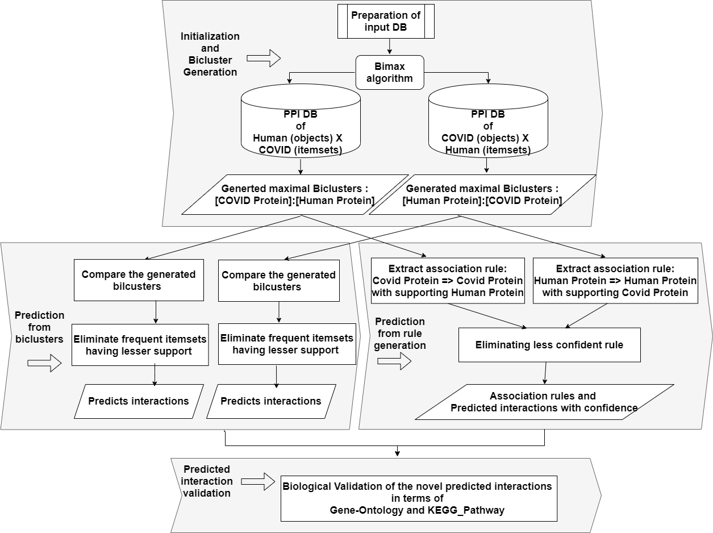

# SARS-CoV-2

This repository contains the approach of bimax biclustering on the manually curated protein–protein interaction dataset of SARS-COV-2 and human protein. It has been shown the procedure used for predicting interactions from biclusters and from the generated rules as well. Moreover, the prediction has been related to gene ontology- and KEGG-pathway-based study using two well-known bioinformatics tool.

## Table of Contents

- [Introduction](#Introduction) 
- [Proposed framework](#Proposed_framework) 
- [Dataset](#Dataset) 
- [Tools used](#Tools_used)
- [References](#References)

- [Introduction](#Introduction)
COVID-19 pandemic defined a worldwide health crisis into a humanitarian crisis. Amid this global emergency, human civilization is under enormous strain since no proper therapeutic method is discovered yet. A wave of research effort has been put toward the invention of therapeutics and vaccines against COVID-19. Contrarily, the spread of this fatal virus has already infected millions of people and claimed many lives all over the world. Computational biology can attempt to understand the protein–protein interactions between the viral protein and host protein. Therefore, potential viral–host protein interactions can be identified which is known as crucial information toward the discovery of drugs. In this study, an approach was presented for predicting novel interactions from maximal biclusters. Additionally, the predicted interactions are verified from biological perspectives. For this, a study was conducted on the gene ontology and KEGG-pathway in relation to the newly predicted interactions.

- [Proposed framework](#Proposed_framework)

- [Dataset](#Dataset)
- The experimental dataset is created by combining PPI interactions from two different sources viz, BioGRID repository and a research article [1].
BioGRID is a conventional biological repository for protein-protein interaction, genetic interaction, etc.
The dataset consists of 28 SARS-CoV-2 proteins and 346 human proteins and a total of 1255 interaction data. In the dataset, 1 represents an interaction between the human protein and viral protein. This binary dataset is treated as an input to the bimax algorithm.

SARS-CoV-2-Human PPI dataset is denoted as HxC where the rows represent the human proteins and the columns represent the viral proteins. In this case, we get the clustered itemsets of SARS-CoV-2 proteins that have a similar interaction pattern for a subset of objects of human proteins. We have also used the transposed form of the SARS-CoV-2-Human PPI dataset which is
represented by the CxH. The aim of this transposed data is to obtain the clusters along with the human proteins for a subset of objects of SARS-CoV-2 proteins. From the statistics represented in Table 1, it could be justified that to cover all the possibilities, we need to experiment on both the original and the transposed datasets as there is a difference in the obtained results of the biclusters in both cases. Here, each bicluster specifies that with a subset of human proteins, a subset of SARS-CoV-2 proteins interacts and vice versa.

-[Tools used](#Tools_used)

 1. Cytoscape: To draw network for predicted interactions Cytoscape (https://cytoscape.org/) hsa been used.
      
 3. DAVID: To justify the prediction, we have tried to find relevance with the help of biological interpretation.
For this, we make use of DAVID (http://david.abcc.ncifcrf.gov), a freely available online bioinformatics repository that provides functional annotations for a large set of genes.
Among the multiple pieces of information extracted from this tool, we opt for the gene ontology (GO) based and KEGG\_Pathway-based study.

4. REVIGO: we extract the non-redundant informative GO terms, based upon the p-values (taken from DAVID generated result), by using another tool REVIGO (http://revigo.irb.hr/).
It reveals the outliers from the list of submitted GO-terms via checking the semantic similarity and outputs a sorted list based upon dispensability value for each GO-term.

## References
[1] Gordon, D. E., Jang, G. M., Bouhaddou, M., Xu, J., Obernier, K., White, K. M., ... & Krogan, N. J. (2020). A SARS-CoV-2 protein interaction map reveals targets for drug repurposing. Nature, 583(7816), 459-468.

## ORIGINAL PAPER
**Moumita Ghosh, Pritam Sil, Anirban Roy, Rohmatul Fajriyah & Kartick Chandra Mondal** - *Finding Prediction of Interaction Between SARS-CoV-2 and Human Protein: A Data-Driven Approach* - [Link To Paper](https://link.springer.com/article/10.1007/s40031-021-00569-7#Tab1)

